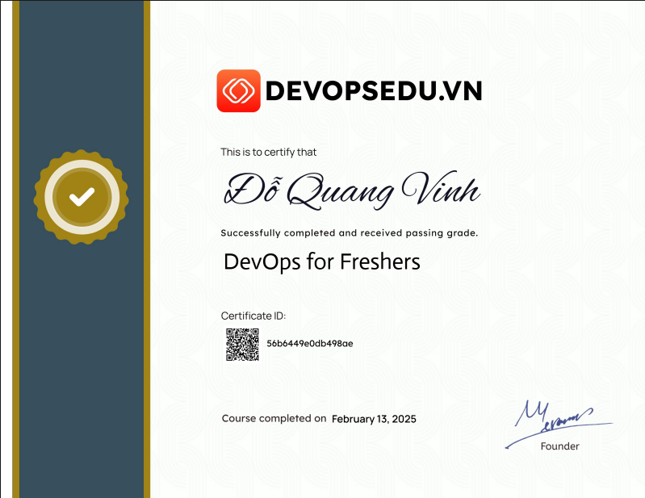

  

<h1 align="center">Hi 👋, I'm Do Quang Vinh</h1>

<h3 align="center">
Backend Developer • DevOps Engineer
</h3>

Backend Developer & DevOps Engineer. Đam mê tối ưu hóa quy trình CI/CD, tự động hóa hạ tầng và xây dựng hệ thống RESTful API mạnh mẽ.

---

## 🎯 Công cụ & Công nghệ sử dụng (Tech Stack)

Mình tập trung phát triển sâu vào luồng vận hành hệ thống (DevOps pipeline) kết hợp nền tảng lập trình Backend chắc chắn để đảm bảo ứng dụng luôn được triển khai mượt mà, tự động và an toàn.

  
  
  
  
  
  
  
  
  
  
  
  
  
  
  
  
  
  
  

---

## 🏆 Thành tích nổi bật
  * 🥉 **Giải Ba Cuộc thi "Ý tưởng và Vấn đề cấp bách"** — Cấp bởi trường Đại học Công Thương TP.HCM (HUIT).
  * ✨ **Học bổng Khuyến khích Học tập HUIT** nhờ duy trì mức GPA xuất sắc **3.61 / 4.0**.
  * 🔬 **Thành viên Nghiên cứu Khoa học** cấp Trường & Tham gia Cuộc thi Sinh viên Nghiên cứu Khoa học **Eurika**.

## ⚜️ Các chứng chỉ quan trọng

## 📊 Đánh giá năng lực GitHub (GitHub Stats)

  

  

  

---

 
  🎯 <i>"Tối ưu hệ thống và quy trình làm việc là niềm đam mê hàng ngày."</i>

